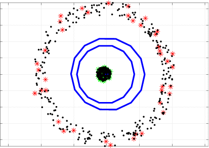
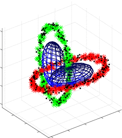

------------------------------------------------------------------------------------------
# Classtering: Variational Bayesian Mixtures of Factor Analysers
------------------------------------------------------------------------------------------
			
## Description
Matlab code for paper [Classtering: Joint Classification and Clustering with Mixture of Factor Analysers](http://ebooks.iospress.com/volumearticle/44861) 

## Demos	
run
* demo_cake_ssl
* demo_gauss_ssl
* demo_spiral_ssl
* demo_ring_ssl
* demo_chainlink_ssl
* demo_atom_ssl
	
### Datasets

| CAKE | Ring | Chainlink | Spiral |
|---|---|---|---|
|  |  |  |  |


## Other information
* This package is free for academic usage. You can run it at your own risk. For other purposes, please contact me.

* If you use this software, please cite as:
```
@inproceedings{sansone2016classtering,
  title={Classtering: Joint Classification and Clustering with Mixture of Factor Analysers},
  author={Sansone, Emanuele and Passerini, Andrea and De Natale, Francesco},
  booktitle={ECAI},
  year={2016},
  organization={IOS PRESS}
}
```
